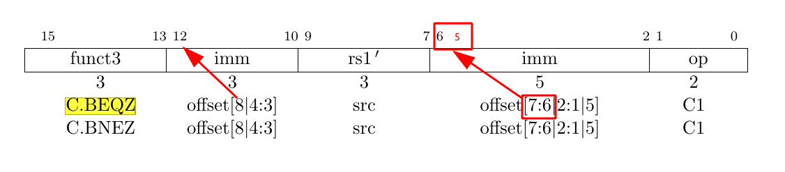

[Rocket](../Readme.md)/[rocket](../rocket.md)/[RVC](https://github.com/freechipsproject/rocket-chip/blob/master/src/main/scala/rocket/RVC.scala)
========================
*RVC decoder.*

*****************

class ExpandedInstruction
------------------
*Norm form of instruction after RVC decoding.*


+ Bundle component

| name                   | type             | description                           |
| :---                   | :--:             | :---                                  |
| bits                   | UInt             | the decoded 32-bit instruction        |
| rd                     | UInt             | index of the destination register     |
| rs1                    | UInt             | index of the source register 1        |
| rs2                    | UInt             | index of the source register 2        |
| rs3                    | UInt             | index of the source register 3        |


class RVCDecoder
------------------------
`def inst(bits: UInt, rd: UInt = x(11,7), rs1: UInt = x(19,15), rs2: UInt = x(24,20), rs3: UInt = x(31,27))` is used with default arguments when not `usingCompressed`. (passthrough mode)


`def decode`: is used when `usingCompressed` (decode mode)

RVC instruction의 quadrant 0,1,2에 속하는 모든 instruction들을 Seq에 담고, {x(1,0), x(15,13)}(op, funct3) 에 해당하는 5비트를 이용하여 해당되는 instruction을 선택. 각각의 instruction은 q0,q1,q2의 하위메소드로 정의된다.

RVC instruction의 op, funct3를 제외한 11비트(2~12)를 재정렬하여 만들수 있는 common 한 method들(e.g. rs1p, lwImm, ldImm, ...) 이 predefine 되어있고, 이러한 method를 사용하여 RV32, RV64, RV128의 형태로 Expand하여 결과를 내보낸다.


#### C.BEQZ instruction decoding 예시



```
def bImm = Cat(Fill(5, x(12)), x(6,5), x(2), x(11,10), x(4,3), 0.U(1.W))
def beqz = inst(Cat(bImm(12), bImm(10,5), x0, rs1p, 0.U(3.W), bImm(4,1), bImm(11), 0x63.U(7.W)), 
                rs1p, rs1p, x0)
```
먼저, immediate value를 만들어내기 위해서 `C.BEQZ`의 `imm` field의 비트들을 `offset[x]`에 써져있는 순서대로 재정렬하여 `bImm`에 배치한다. 
`C.BEQZ` 메소드에서는 이렇게 재정렬된 `bImm` value를 RV32에 대응되는 `BEQ` instruction과 같은 방법으로 decode를 할 수 있다. 


class RVCExpander
-------------------------
*RVC decoder unit.*

+ I/O, type and parameters

| name                   | type             | direction  | description                           |
| :---                   | :--:             | :--:       | :---                                  |
| p                      | Parameters       | param      | configuration                         |
| in                     | UInt             | I          | raw instruction                       |
| out                    | [ExpandedInstruction](#class-expandedinstruction) | O | decoded instruction |
| rvc                    | Bool             | O          | whether the output instruction is compressed |

<br><br><br><p align="right">
<sub>
Last updated: 08/07/2017<br>
[CC BY-NC-SA 4.0](https://creativecommons.org/licenses/by-nc-sa/4.0/), &copy; (2017) [Wei Song](mailto:wsong83@gmail.com)<br>
[Apache 2.0](https://github.com/freechipsproject/rocket-chip/blob/master/LICENSE.SiFive), &copy; (2016-2017) SiFive, Inc<br>
[BSD](https://github.com/freechipsproject/rocket-chip/blob/master/LICENSE.Berkeley), &copy; (2012-2014, 2016) The Regents of the University of California (Regents)
</sub>
</p>
