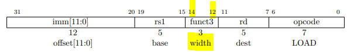
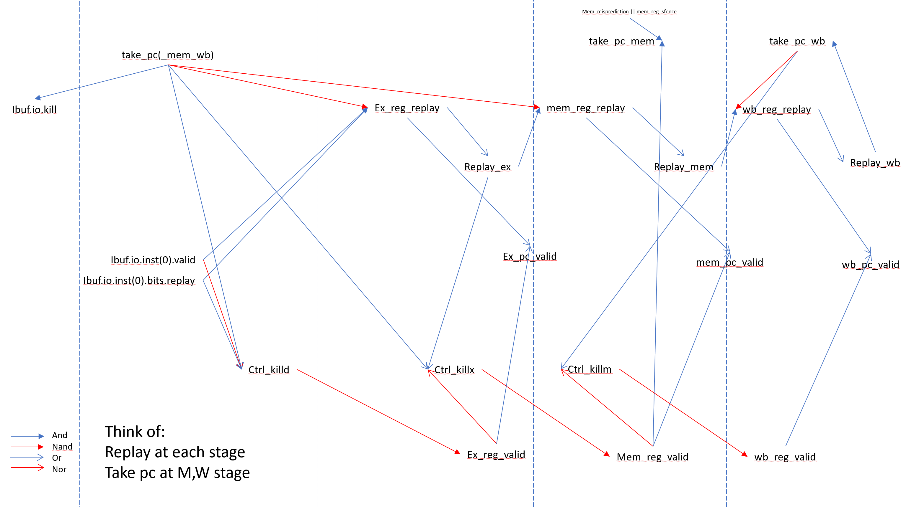

## case class RocketCoreParams
- sets parameters to the rocket core, lazily evaluated 
- extends `CoreParams` from `tile/Core.scala`

## class RocketCustomCSRs
Not read yet

## class Rocket
- generates IO using `HasCoreIO`, with parameter from `HasRocketCoreParameters`
- `NoChiselNamePrefix` for avoiding RocketImpl being prefixed
- `XX_reg_YY`: instantiates XX stage registers named YY

<!--#### PC gen & Fetch Stage-->

### Decode Stage
- `decode_table`: a mapping of Instructions -> List of control signals which are assigned into `id_ctrl` Wire.
- `def decodeReg`: extracts RegFile addresses from instruction. Also checks whether the instruction is legal with appropriate number of registers (if RVE 16, else 32).
- `rf`: instatiates a RegFile. 31 entries RV32, 15 entries in RVE, each with `xLen` width.
- `id_rs`: contains rs1, rs2 values read from the RegFile
- `csr`: instance of CSRFile (Control Status Register File, pcr) details in `CSR.scala` (TODO)
- `id_scie_decoder`: instance of SCIEDecoder (SiFive Custom Instruction Extension Decoder) details in `SCIE.scala` (TODO)
- `bpu`: instance of BPU (Breakpoint Unit), details in `BPU.scala` (TODO)
- Picks the highest priority (exception, cause) from various sources(`csr`, `bpu`, `FrontendResp`,`id_illegal_inst`) and store it into `(id_xcpt, id_cause)`
- **Bypass (Forwarding)**
  - `bypass_sources` holds information on bypass sources in list of tuple(condition, waddr, wdata).
    - First element indicates the bypass conditions (upper in the list have higher priority). Condition includes treating x0 as bypass, whether the data to be written is passing the EX or MEM stage, and whether the operation reads from L1 data to write to RegFile (e.g. LD))
    - Second element indicates the write address
    - Last element indicates the source of the write data (0, `mem_reg_wdata`, `wb_reg_wdata`, `dcache_bypass_data`)
  - It is notable that WB stage bypass is handled in RegFile
  - `id_bypass_src` stores whether rs1, rs2 needs forwarding for different bypass sources (2x4 boolean entries) by checking if write condition is true and if read/write address matches.

### Execute Stage
- `bypass_mux`: contains the wdata from `bypass_sources` (00 -> 0, 01 -> `mem_reg_wdata`, 
- `ex_rs` : for each rs (rs1, rs2), yield a mux to select bypassed data indexed by `ex_reg_rs_lsb` or original rs data
- `ex_op1` and `ex_op2` : select which operands to use (rs1/pc, rs2/imm/size)
  - size is used for JAL instruction to indicate the next pc. (either pc+4 or pc+2)
- `alu` : instantiate a alu module with injecting io signals (dw(double word), fn(function), in2, in1)
- `div` : instantiate a MulDiv module (when `pipelinedMul` is turned off then set mulUnroll to 0)
- `mul` : instantiate a pipelinedMul module
- `when(!ctrl_killd)` 
  - `when(id_fence...)` : TODO
  - `when(id_xcpt)` : deals with different `id_xcpt` causes and configure ALU to send specific data down the writeback pipeline.  
  For xcpts in FrontendResp and BPU (`xcpt0`, `xcpt1`, `bpu.io.xcpt_if`), send corresponding PC, PC+2 down the pipeline to Exception Program Counter (EPC) TODO: 'bpu.io.xcpt_if'  
  For other xcpts causes, send the instruction (configured as rs1 + 0). 
- `ex_reg_mem_size := id_inst(0)(13,12)` : [13:12] bit field represents log2 of data width in Bytes (00: 8bit(LB), 01: 16bit(LH), 10: 32bit(LW)) ([14] bit field represents unsigned memory operation) 

- `do_bypass` : checks whether bypassing needed
- `bypass_src` : select the source to bypass by PriorityEncoder (prioritized in order of x0 -> mem_wdata -> wb_wdata -> D$data)
- `ex_reg_rs_lsb` and `ex_reg_rs_msb` : When bypassing occurs, assign bypass source to lsb and ignore msb. Otherwise, pass through original rs.
- `when (id_illegal_insn)` : store the instruction in rs1
- `replay_ex` : replay if ex_reg_replay or structural hazard or load bypassing failure due to D$ miss
- `ctrl_killx` : checks whether to kill inst in ex stage 
- `ex_slow_bypass` : set flag of slow bypassing when it takes 2 cycles to use data from LB/LH/SC (sign extension in WB stage?)

### Memory Stage
- `mem_br_target` : which branch target to jump (taken branch's target, JAL target, or next PC)
- `mem_npc` : if jalr or sfence, get encoded Virtual Address, else get branch target. Then AND with -2 (=1111...110), to make the PC a multiple of 2. (TODO)
    - More into Virtual Address: (with default option, PAddr=32, v=39, and XLen=64) : unmatched with spec - Why?  +  sign extend with VA and zero extend with PA, why? 
- `mem_wrong_npc`: (When using branch predictor) checks if the predicted npc was correct (ex_pc_valid: EX / inst.valid: ID / imem.valid: IF).
- `mem_direction_misprediction` : checks whether the direction (taken or not) is mispredicted for branch instructions.
- `mem_misprediction` : checks whether the prediction was correct.
- `take_pc_mem : checks if npc misprediction occurred or sfence(TODO), when the stage is valid (mem_reg_valid).
- `mem_reg_flush_pipe` : seems to be related to sfence instruction (TODO)
- `elsewhen(ex_pc_valid)` : pass over signals from EX stage to MEM stage, conditioned by ex_pc_valid (stage is valid or to be replayed)
  - TODO: flush I$ on D-mode JALR
- TODO: mem_breakpoint
- `replay_mem` : replay when dcache kill (structural hazard on writeback port), mem_reg_replay, or FPU kill
- `ctrl_killm` : kill when dcache kill, memory exception, or FPU kill

### Write Back Stage
- `when(mem_pc_valid)` : pass over signals from MEM stage to WB stage, conditioned by mem_pc_valid
- `replay_wb` : replay if wb_reg_replay or io.dmem.s2_nack or rocc not ready
- `take_pc_wb` : take pc if replay_wb or exception or ERET or flushing pipeline
- `ll_wdata, ll_waddr` : Long Latency instructions - wired default to division module response data/tag; If using RoCC & it is fired, wired to rocc response data/rd
- `rf_wdata, rf_waddr` : Register File data/addr - dmem or ll(long latency) or CSR(PCR) or from reg_wdata(alu, fpu, or JR inst., etc.)
- `id_sboard_hazard` : checks if ID stage tries to read the data yet uncommitted from scoreboard, turning on stall signal at ID stage. 

### class Scoreboard
- keeps information about the (long-latency - division, D$ miss, RoCC) instructions being executed. The register is updated at WB stage and has to be kept reserved until the instruction is finished. When instruction finishes with ll_wen signal set, it clears the bit.
- set(en: Bool, addr: UInt): updates the bit of the sboard
- clear(en: Bool, addr: UInt): clears the bit of the sboard
- read(addr: UInt): reads sboard content

## class RegFile
- arguments: `(n: Int, w: Int, zero: Boolean = false)`
  - `xLen` as width `w`
  - `regAddrMask` as entry number `n`: 15 if `useRVE (embedded)` else 31
- used to make register file of the core
- rf is implemented as Mem(n, w)
- `read(addr: UInt)`: reads from certain register
- `write(addr: UInt, data: UInt)`: supports forwarding (when `wb_waddr == id_radder`, other cases are dealt using `bypass_sources`)

